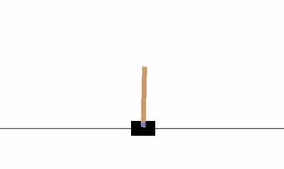

# DQN for cartpole-v0 using pytorch

- PyTorch implementation of [DQN](https://arxiv.org/abs/1312.5602) for [cartpole-v0](https://gym.openai.com/envs/CartPole-v1/)

- The neural network consists of an input layer, 3 Linear layers with RELU activations and an output layer which outputs Q values for each action for given state.
## Dependencies

### Trained on
- Python 3.7
- PyTorch 1.5.1
- numpy 1.18.1
- gym 0.17.2

## Results

Initial     |   After 1000 episodes
:-------------------------:|:-------------------------:
  | 

## Plot

- The blue line represents duration of current episode and the orange line represents average of the last 100 episodes.

*Yet to solve
(CartPole-v0 defines "solving" as getting average reward of 195.0 over 100 consecutive trials).
