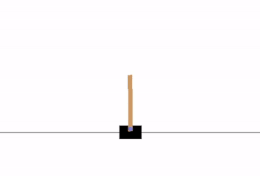

# DQN for cartpole-v0 using pytorch

- PyTorch implementation of [Double Q-learning](https://arxiv.org/pdf/1509.06461.pdf) for [CartPole-v0](https://gym.openai.com/envs/CartPole-v0/)

- The neural network consists of an input layer, 2 Linear layers with RELU activations and an output layer which outputs Q values for all actions for given state.

## Dependencies

### Trained on

- Python 3.7
- PyTorch 1.5.1
- numpy 1.18.1
- gym 0.17.2
  
### Hyper Parameters

- batch_size = 128
- gamma = 0.999
- eps_start = 0.99
- eps_end = 0.01
- eps_decay = 0.001
- target_update = 5
- memory_size = 100000
- lr = 0.001

## Usage

### Play

    python cartpole.py play

### Train

    python cartpole.py train

## Results

Initial     |   After 500 episodes
:-------------------------:|:-------------------------:
  | 

## Plot

- The blue line represents the duration of current episode and the orange line represents the average of the last 100 episodes.

*The environment was solved at around 200 episodes.
